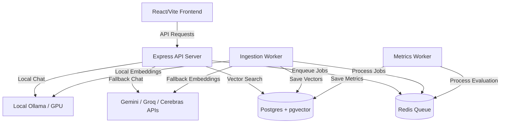

# DevScope 📚

**DevScope** is an intelligent Retrieval-Augmented Generation (RAG) platform that allows you to ingest GitHub repositories, index their codebases semantically, and ask questions about the code using local or cloud-based Large Language Models.

---

## 🚀 Features

- **GitHub Ingestion**: Fetches and processes codebases dynamically using the GitHub Trees API.
- **Semantic Code Search**: Stores and retrieves code chunks using **PostgreSQL** with the **`pgvector`** extension for high-performance cosine similarity searches.
- **Smart Code Chunking**: Recursively splits code files based on programming language syntax to preserve logical blocks.
- **Resilient AI Pipeline**: Supports local inference via **Ollama** (`llama3.2` LLM, `nomic-embed-text` embeddings) with automatic, multi-layered cloud API fallbacks (**Google Gemini API**, **Groq**, and **Cerebras**) if local services are not hosted.
- **Asynchronous Workflows**: Employs **BullMQ** & **Redis** to run reliable background ingestion and metrics calculation queues.
- **RAG Quality Evaluation**: Automatically evaluates retrieval accuracy (context precision, cosine similarity) and stores metrics.
- **Interactive UI**: Clean React dashboard built with **Vite** featuring full markdown formatting, syntax highlighting, copyable code blocks, and repo analytics.

---

## 🛠️ Tech Stack

- **Frontend**: React, Vite, TypeScript, Lucide Icons, Vanilla CSS
- **Backend API & Workers**: Node.js (TypeScript), Express.js
- **Database**: PostgreSQL (with `pgvector` extension)
- **Cache & Queue**: Redis (via BullMQ)
- **AI/ML Integration**: LangChain, Google Gemini API, Groq Cloud, Cerebras API, Ollama

---

## 🏗️ Architecture



---

## 📦 Setup & Installation

### Prerequisites
- Node.js (v20+)
- Docker and Docker Compose

### 1. Configure Environment Variables
Create a `.env` file in the `backend/` directory:
```env
PORT=5000

# Databases
POSTGRES_HOST=localhost
POSTGRES_PORT=5432
POSTGRES_USER=postgres
POSTGRES_PASSWORD=postgres
POSTGRES_DB=repo_explainer

REDIS_HOST=localhost
REDIS_PORT=6379

# Ollama Endpoint
OLLAMA_BASE_URL=http://localhost:11434

# API Keys (Required for Cloud Fallbacks)
GOOGLE_API_KEY=your_gemini_api_key
GROQ_API_KEY=your_groq_api_key
CEREBRAS_API_KEY=your_cerebras_api_key
GITHUB_TOKEN=your_github_personal_access_token

# Frontend Link
FRONTEND_LINK=http://localhost:5173
```

---

## 🏃‍♂️ Running the Application

### Method A: Local Development (With Docker for Databases)

1. **Start Postgres and Redis**
   ```bash
   docker run -d --name dev_postgres -p 5432:5432 -e POSTGRES_PASSWORD=postgres pgvector/pgvector:pg16
   docker run -d --name dev_redis -p 6379:6379 redis:7-alpine
   ```

2. **Initialize Database Schema**
   Apply the SQL schema defined in [init.sql](file:///d:/Documents/Project/DevScope/init.sql) to your Postgres instance.

3. **Run Backend Services**
   ```bash
   cd backend
   npm install
   # Start the Express API server and queues
   npm run dev
   ```
   *Note: In separate terminals, ensure your background workers are running (e.g., `npx tsx src/workers/ingestWorker.ts` and `npx tsx src/workers/metricsWorker.ts`).*

4. **Run Frontend App**
   ```bash
   cd frontend
   npm install
   npm run dev
   ```

---

### Method B: Full Stack Deployment via Docker Compose
To build and run all services (including the workers, databases, local Ollama, and a production-ready build of the frontend), run:
```bash
docker-compose up --build
```
This runs:
- **Frontend** served on port `80`
- **Backend API** served on port `5000` (proxied by the frontend container)
- **Postgres** on port `5432`
- **Redis** on port `6379`
- **Ollama** on port `11434` (with GPU support if configured)
- **Ingestion & Metrics Workers** in the background
