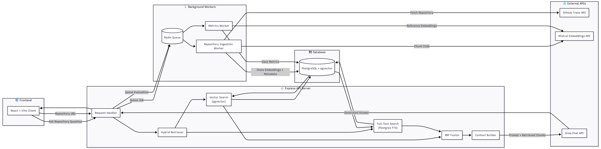

# DevScope 📚

**DevScope** is an intelligent Retrieval-Augmented Generation (RAG) platform that allows you to ingest GitHub repositories, index their codebases semantically, and ask questions about the code using local or cloud-based Large Language Models.

---

## 🚀 Features

- **GitHub Ingestion**: Fetches and processes codebases dynamically using the GitHub Trees API.
- **Semantic Code Search**: Stores and retrieves code chunks using **PostgreSQL** with the **`pgvector`** extension for high-performance cosine similarity searches.
- **Smart Code Chunking**: Recursively splits code files based on programming language syntax to preserve logical blocks.
- **Resilient AI Pipeline**: Supports local inference via **Ollama** (`llama3.2` LLM, `nomic-embed-text` embeddings) with automatic, multi-layered cloud API fallbacks (**Google Gemini API**, **Groq**, and **Cerebras**) if local services are not hosted.
- **Asynchronous Workflows**: Employs **BullMQ** & **Redis** to run reliable background ingestion and metrics calculation queues.
- **RAG Quality Evaluation**: Automatically evaluates retrieval accuracy (context precision, cosine similarity) and stores metrics.
- **Interactive UI**: Clean React dashboard built with **Vite** featuring full markdown formatting, syntax highlighting, copyable code blocks, and repo analytics.

---

## 🛠️ Tech Stack

- **Frontend**: React, Vite, TypeScript, Lucide Icons, Vanilla CSS
- **Backend API & Workers**: Node.js (TypeScript), Express.js
- **Database**: PostgreSQL (with `pgvector` extension)
- **Cache & Queue**: Redis (via BullMQ)
- **AI/ML Integration**: LangChain, Google Gemini API, Groq Cloud, Cerebras API, Ollama

---

## 🏗️ System Architecture

The following diagram illustrates how the components of DevScope interact:



---

## 🗄️ Database Schema & Triggers

The database schemas defined in [init.sql](./init.sql) consist of two main tables:

### 1. `repo_embeddings`
Stores code chunks, their metadata, vector embeddings, and full-text search configurations.
- `id`: UUID (Primary Key)
- `repo_name`: TEXT (Target repository identifier)
- `file_path`: TEXT (Relative path to the file in the repository)
- `language`: TEXT (Programming language detected from extension)
- `content`: TEXT (Raw text content of the code chunk)
- `embedding`: `VECTOR(1024)` (Dense semantic embedding generated by Mistral)
- `search_vector`: `TSVECTOR` (Sparse representation for PostgreSQL full-text search)

**Automatic Triggers:**
A PostgreSQL trigger runs `BEFORE INSERT OR UPDATE` to dynamically compute and update `search_vector`. It assigns a higher weight (`A`) to matching characters in `file_path` and a lower weight (`B`) to those in code `content`:
```sql
CREATE OR REPLACE FUNCTION repo_embeddings_trigger_func() 
RETURNS trigger AS $$
BEGIN
  NEW.search_vector := 
    setweight(to_tsvector('english', COALESCE(NEW.file_path, '')), 'A') ||
    setweight(to_tsvector('english', COALESCE(NEW.content, '')), 'B');
  RETURN NEW;
END
$$ LANGUAGE plpgsql;
```
A GIN index (`repo_embeddings_search_vector_idx`) is applied on `search_vector` to speed up text matches.

### 2. `rag_metrics`
Keeps track of retrieval performance characteristics for user questions.
- `id`: SERIAL (Primary Key)
- `repo_name`: TEXT
- `question`: TEXT (User query)
- `retrieved_chunks`: TEXT (JSON serialized array of retrieved code snippets with relevance scores)
- `context_precision`: FLOAT (Precision rating of the retrieved chunks relative to the answer)
- `avg_similarity`: FLOAT (Average similarity score from the Reciprocal Rank Fusion)
- `created_at`: TIMESTAMP

---

## ⚡ Core Workflows

### 1. Repository Ingestion Pipeline
When a user submits a GitHub repository URL:
1. **Queue Enlistment:** The API endpoint `/ingest` enqueues an ingestion job in **Redis** via **BullMQ** and returns the `jobId` immediately so the UI doesn't block.
2. **File Fetching:** The [ingestWorker.ts](./backend/src/workers/ingestWorker.ts) processes the job, parses the repository details, and pulls repository contents recursively using the GitHub Trees API in [fetchRepoFiles.ts](./backend/src/github/fetchRepoFiles.ts). It ignores lockfiles, non-code assets, and directories like `node_modules` or `dist`.
3. **Smart Chunking:** The code content is parsed in [fileChunker.ts](./backend/src/chunking/fileChunker.ts). Using LangChain's `RecursiveCharacterTextSplitter`, it splits code files into chunks of roughly `1500` characters (with a `300` character overlap) while honoring language-specific boundaries (like classes or functions).
4. **Vector Generation:** Chunks are sent to the Mistral Embeddings API in [mistralEmbedder.ts](./backend/src/embeddings/mistralEmbedder.ts) in batches to generate 1024-dimensional vectors.
5. **Database Storage:** The records are saved in PostgreSQL via [insertVectors.ts](./backend/src/vectorStore/insertVectors.ts).

### 2. Q&A and Hybrid Retrieval
When a user asks a question about a repository:
1. **Embedding Generation:** The system embeds the user's question using the Mistral Embeddings API.
2. **Parallel Retrieval:** In [hybridSearch.ts](./backend/src/retrieval/hybridSearch.ts), the backend executes two parallel search queries in Postgres:
   - **Dense vector search** using pgvector's cosine distance operator (`<=>`) to get the top 20 closest code chunks.
   - **Sparse full-text search** using Postgres's `websearch_to_tsquery` matching against the trigger-updated `search_vector` to get the top 20 relevant text chunks.
3. **Reciprocal Rank Fusion (RRF):** The system merges the outputs of both searches. RRF assigns a score based on a chunk's reciprocal rank in each search result list:
   $$\text{RRF Score} = \sum_{m \in M} \frac{1}{k + r_m(d)}$$
   where $k = 60$ and $r_m(d)$ is the rank (1-indexed) of document $d$ in search $m$. The top `8` chunks by fusion score are retained.
4. **LLM Generation:** The retrieved chunks are structured into a prompt context template and sent to Groq (`llama-3.1-8b-instant`) in [groqLLM.ts](./backend/src/llm/groqLLM.ts) to get the answer.
5. **Metrics Logging:** An evaluation job is enqueued in the `metricsQueue` to capture RAG metrics.

### 3. RAG Metrics Evaluation
The [metricsWorker.ts](./backend/src/workers/metricsWorker.ts) runs in the background to avoid adding latency to the client's answer response.
1. **Context Precision calculation:** It computes precision by comparing the retrieved chunks with the LLM's final answer using [contextPrecision.ts](./backend/src/testRetrival/contextPrecision.ts).
2. **Relevance Scoring:** The worker embeds both the generated answer and each retrieved context chunk. If the cosine similarity between the answer's embedding and a chunk's embedding exceeds `0.55`, the chunk is deemed "relevant".
3. **Storage:** The calculated precision and average similarity are stored in the `rag_metrics` table for reporting on the frontend dashboard.

---

## 📂 Source Code Component Map

Here are the key files making up the codebase:

### Database & Setup
- [init.sql](./init.sql) — Postgres tables, indices, and full-text search trigger function definitions.
- [docker-compose.yml](./docker-compose.yml) — Container definitions for Postgres, Redis, and workers.

### Backend Application
- [backend/src/index.ts](./backend/src/index.ts) — Express router defining `/ingest`, `/ask`, `/repositories`, `/status/:jobId`, `/metrics/:repoName`.
- [backend/src/github/fetchRepoFiles.ts](./backend/src/github/fetchRepoFiles.ts) — Integrates with GitHub Tree APIs and filters non-code files.
- [backend/src/chunking/fileChunker.ts](./backend/src/chunking/fileChunker.ts) — Splits files using Langchain splitters by target programming language syntax.
- [backend/src/embeddings/mistralEmbedder.ts](./backend/src/embeddings/mistralEmbedder.ts) — Embeds queries and code blocks via Mistral API.
- [backend/src/retrieval/hybridSearch.ts](./backend/src/retrieval/hybridSearch.ts) — Dense/Sparse search merging via Reciprocal Rank Fusion (RRF).
- [backend/src/llm/answerQuestion.ts](./backend/src/llm/answerQuestion.ts) — Master coordinator for Q&A loop.
- [backend/src/workers/ingestWorker.ts](./backend/src/workers/ingestWorker.ts) — Ingest pipeline background worker.
- [backend/src/workers/metricsWorker.ts](./backend/src/workers/metricsWorker.ts) — Evaluation pipeline background worker.

### Frontend Application
- [frontend/src/App.tsx](./frontend/src/App.tsx) — Main dashboard viewport displaying metrics and repository selectors.
- [frontend/src/components/ChatInterface.tsx](./frontend/src/components/ChatInterface.tsx) — Handles messaging interface, rendering context references and answers.
- [frontend/src/api/services.ts](./frontend/src/api/services.ts) — Client-side API request layer communicating with the Express backend.

---

## 📦 Setup & Installation

### Prerequisites
- Node.js (v20+)
- Docker and Docker Compose

### 1. Configure Environment Variables
Create a `.env` file in the `backend/` directory:
```env
PORT=5000

# Databases
POSTGRES_HOST=localhost
POSTGRES_PORT=5432
POSTGRES_USER=postgres
POSTGRES_PASSWORD=postgres
POSTGRES_DB=repo_explainer

REDIS_HOST=localhost
REDIS_PORT=6379

# Ollama Endpoint
OLLAMA_BASE_URL=http://localhost:11434

# API Keys (Required for Cloud Fallbacks)
GOOGLE_API_KEY=your_gemini_api_key
GROQ_API_KEY=your_groq_api_key
CEREBRAS_API_KEY=your_cerebras_api_key
GITHUB_TOKEN=your_github_personal_access_token

# Frontend Link
FRONTEND_LINK=http://localhost:5173
```

---

## 🏃‍♂️ Running the Application

### Method A: Local Development (With Docker for Databases)

1. **Start Postgres and Redis**
   ```bash
   docker run -d --name dev_postgres -p 5432:5432 -e POSTGRES_PASSWORD=postgres pgvector/pgvector:pg16
   docker run -d --name dev_redis -p 6379:6379 redis:7-alpine
   ```

2. **Initialize Database Schema**
   Apply the SQL schema defined in [init.sql](file:///d:/Documents/Project/DevScope/init.sql) to your Postgres instance.

3. **Run Backend Services**
   ```bash
   cd backend
   npm install
   # Start the Express API server and queues
   npm run dev
   ```
   *Note: In separate terminals, ensure your background workers are running (e.g., `npx tsx src/workers/ingestWorker.ts` and `npx tsx src/workers/metricsWorker.ts`).*

4. **Run Frontend App**
   ```bash
   cd frontend
   npm install
   npm run dev
   ```

---

### Method B: Full Stack Deployment via Docker Compose
To build and run all services (including the workers, databases, local Ollama, and a production-ready build of the frontend), run:
```bash
docker-compose up --build
```
This runs:
- **Frontend** served on port `80`
- **Backend API** served on port `5000` (proxied by the frontend container)
- **Postgres** on port `5432`
- **Redis** on port `6379`
- **Ollama** on port `11434` (with GPU support if configured)
- **Ingestion & Metrics Workers** in the background
